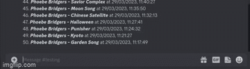
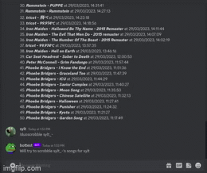
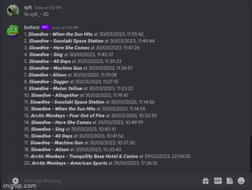
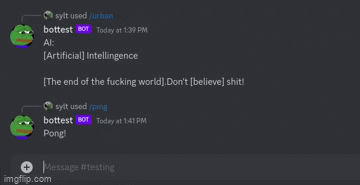

# Discbot

A Discord bot written in javascript with [Nodejs](https://nodejs.org/en/), [Discordjs](https://discord.js.org/#/) and [MongoDB](https://www.mongodb.com/).

# Features

Here are a few of the most notable features of the bot:

* Play music from Youtube to your voice channel, either by giving it a link or a song title. [```!play "url or title"```]
* Using [LastFM's](https://www.last.fm/home) API the bot can "Duoscrobble" as I call it. [```!duoscrobble "lastFMuser"```]. The bot will make sure you get the same scrobbles as the user "lastFMuser". Very useful command when listening to music with your friends. You will have to connect your LastFM account to your Discord account. Examples:

- Duoscrobble example:



- List scrobbles example:



- Multiscrobble example:



* Search up a persons match history in the game [League of Legends](https://www.leagueoflegends.com/en-us/), using the Riot Games API.[```/summoner "username"```]



* And a few more minor features!


